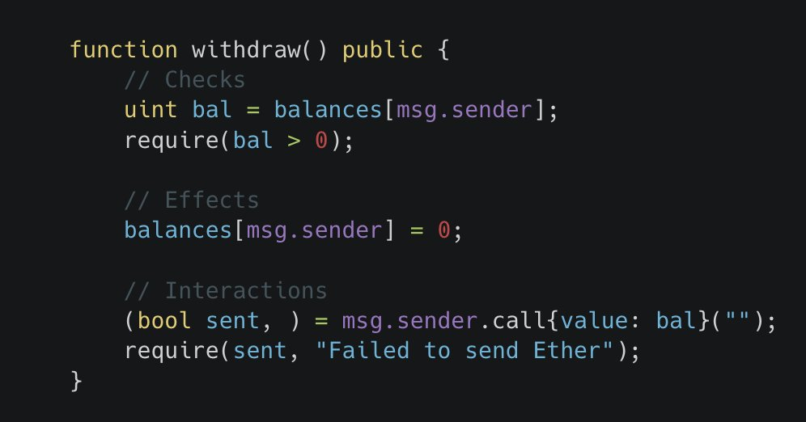

# Design Patterns

## CEI

checks, effects, interactions

1. Do require statements
2. Do effects with our contracts
3. Do interactions with external contracts

but this is too scoped. too narrow.
we should keep CEI for functions. but also check the larger protocol's invariant...

**Function**

- Requirements
- Effects
- Interactions

**Protocol**

- Invariants

